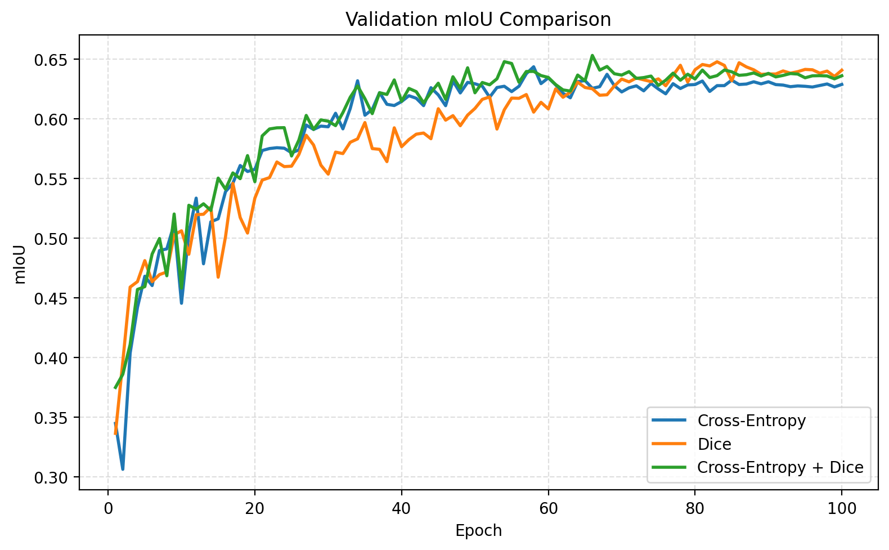

# Task 3 Report
## 吉张杰 25110980010

## 1. 实验目标

本实验对应 HW2 的 Task 3，目标如下：

1. 从零搭建 `U-Net` 图像分割训练工程。
2. 在 `iccv09Data` 数据集上完成像素级语义分割训练。
3. 手动实现 `Dice Loss`。
4. 分别使用以下三种损失函数配置训练模型，并比较验证集 `mIoU`：
   - `Cross-Entropy Loss`
   - 手写 `Dice Loss`
   - `Cross-Entropy Loss + Dice Loss`

## 2. 数据集与标签

本实验使用 `iccv09Data` 中的语义分割标签 `labels/*.regions.txt`，共 `8` 个类别：

1. `sky`
2. `tree`
3. `road`
4. `grass`
5. `water`
6. `building`
7. `mountain`
8. `foreground_object`

数据和标签处理方式如下：

- 输入图像统一缩放为 `320 x 240`
- 标签中的负数像素表示未知区域
- 未知区域统一映射为 `ignore_index = 255`
- 损失计算与指标统计时忽略未知像素
- 采用固定随机种子 `42`，随机抽取 `15%` 样本作为验证集，其余 `85%` 作为训练集

## 3. 模型结构

模型采用手写 `U-Net`，包含以下组成部分：

- 编码器下采样路径
- 解码器上采样路径
- `Skip Connection`
- 最后 `1x1 Conv` 输出像素级分类结果

该结构能够同时利用高层语义信息和浅层空间细节，适合像素级语义分割任务。

## 4. 损失函数工程

### 4.1 Cross-Entropy Loss

交叉熵损失对每个像素做多分类监督，优点是训练稳定、优化直接，但在类别不平衡情况下容易偏向像素数较多的大类别。

### 4.2 手写 Dice Loss

本实验在 `src/segmentation/losses.py` 中手动实现多类 `Dice Loss`。其核心流程如下：

1. 对网络输出做 `softmax`
2. 将标签转换为 `one-hot`
3. 忽略 `ignore_index` 对应像素
4. 计算预测区域与真实区域的交集和并集
5. 逐类计算 Dice 系数并取平均
6. 使用 `1 - mean(dice)` 作为最终损失

Dice Loss 直接优化区域重叠程度，因此通常对小区域类别和类别不平衡问题更友好。

### 4.3 组合损失

组合损失定义为：

```text
L = L_ce + L_dice
```

其中：

- `L_ce` 负责稳定像素级分类
- `L_dice` 负责优化区域重叠质量

## 5. 实验配置

主要训练配置如下：

| 项目 | 设置 |
|---|---|
| Model | U-Net |
| Dataset | `iccv09Data (regions)` |
| Input Size | `320 x 240` |
| Epochs | `100` |
| Batch Size | `8` |
| Learning Rate | `3e-4` |
| Optimizer | `AdamW` |
| Weight Decay | `1e-4` |
| Validation Split | `15%` |
| Seed | `42` |

## 6. 定量结果

三组损失函数在验证集上的最佳结果如下：

| Loss | Best Epoch | Best Val mIoU | Best Val Pixel Acc |
|---|---:|---:|---:|
| Cross-Entropy | 58 | 0.6436 | 0.8432 |
| Dice | 83 | 0.6477 | 0.8446 |
| Cross-Entropy + Dice | 66 | 0.6531 | 0.8489 |

结果排序如下：

1. `Cross-Entropy + Dice`: `0.6531`
2. `Dice`: `0.6477`
3. `Cross-Entropy`: `0.6436`

可以看出，三组方法都取得了较好的分割效果，其中组合损失获得了最高的验证集 `mIoU`。

### 6.1 各类别 IoU 对比

三种方法在各自最佳 epoch 下的各类别 IoU 与验证集 `mIoU` 如下：

| Method | sky | tree | road | grass | water | building | mountain | foreground_object | Val mIoU |
|---|---:|---:|---:|---:|---:|---:|---:|---:|---:|
| Cross-Entropy | 0.8623 | 0.6661 | 0.8637 | 0.5477 | 0.6559 | 0.7384 | 0.2066 | 0.6077 | 0.6436 |
| Dice | 0.8655 | 0.6631 | 0.8602 | 0.5352 | 0.6490 | 0.7327 | 0.2670 | 0.6093 | 0.6477 |
| Cross-Entropy + Dice | 0.8745 | 0.6686 | 0.8654 | 0.5641 | 0.6605 | 0.7458 | 0.2333 | 0.6124 | 0.6531 |

从表中可以看到：

- `sky`、`road`、`building` 是较容易学习的类别，三种方法都表现较好
- `mountain` 是最难的类别，IoU 明显低于其他类别
- 组合损失在大多数类别上都取得了最优或接近最优的结果，因此整体 `mIoU` 最高

## 7. 三组损失曲线对比

三种损失函数在验证集上的 `mIoU` 对比如下：



分析如下：

- `Cross-Entropy` 收敛速度较快，但最终上限略低
- `Dice` 在中后期持续提升，说明其对区域重叠优化更有效
- `Cross-Entropy + Dice` 兼顾了稳定性和区域优化能力，最终达到最高 `mIoU`

## 8. 混淆矩阵与训练输出

每组实验目录中均保存了：

- `best.pt`
- `last.pt`
- `history.json`
- `history.csv`
- `training_curves.png`
- `best_confusion_matrix.png`

这些文件可用于进一步分析各类别的混淆情况与训练趋势。

## 9. 样例预测结果

以样例图像 `0000382.jpg` 为例，三种方法的预测结果保存在：

- `outputs/0000382_ce.png`
- `outputs/0000382_dice.png`
- `outputs/0000382_combo.png`

从可视化结果可以直观看出：

- `Cross-Entropy` 对主类区域拟合较好，但在少数类边界上略弱
- `Dice` 对部分小区域和结构连续性更友好
- 组合损失在整体结构完整性与局部边界质量之间取得了较好的平衡

## 10. 分析与讨论

### 10.1 为什么组合损失效果最好

组合损失同时利用了：

- `Cross-Entropy` 的稳定像素级分类能力
- `Dice Loss` 对区域重叠更敏感的优势

因此在本实验中，组合损失能够在保持整体分类稳定的同时，提高区域级分割质量，最终取得最高 `mIoU = 0.6531`。

### 10.2 Dice Loss 的优势

`Dice Loss` 的 `mIoU = 0.6477`，略低于组合损失，但仍高于单独使用 `Cross-Entropy`。这说明在前景/背景或类别像素比例不平衡的分割任务中，Dice Loss 对优化区域重叠质量更有帮助。

### 10.3 Cross-Entropy 的特点

单独使用 `Cross-Entropy` 时，模型也能达到 `0.6436` 的验证集 `mIoU`，说明其在该任务上仍具有较好的基线能力，但相比另外两种损失，其对难类和区域重叠的优化能力略弱。

## 11. 结论

本实验从零实现了 `U-Net` 图像分割训练工程，并在 `iccv09Data` 上比较了三种损失函数。结果表明：

- `Cross-Entropy + Dice` 取得了最高验证集 `mIoU = 0.6531`
- `Dice` 次之，为 `0.6477`
- `Cross-Entropy` 为 `0.6436`

因此，在本实验所采用的数据划分和训练配置下，**组合损失 `Cross-Entropy + Dice` 是最优选择**。
