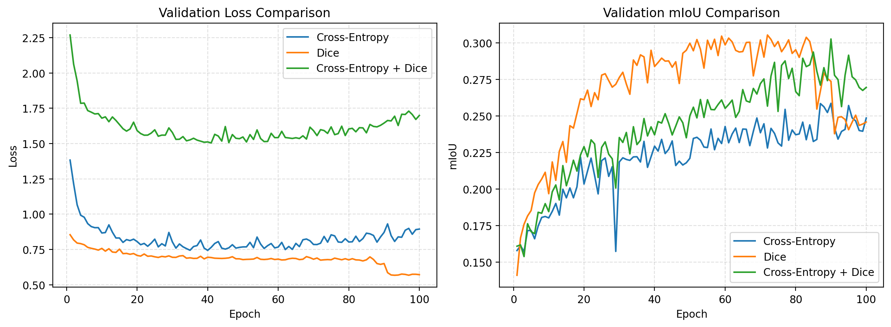
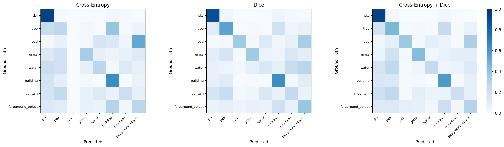
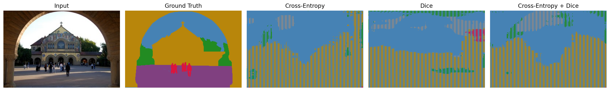
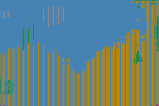
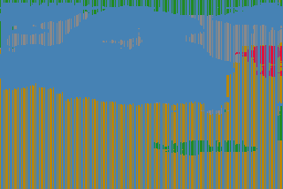
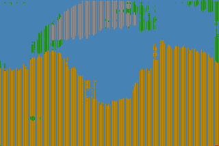

# Task 3 Report
## 吉张林 25110980010

## 1. 实验目标


1. 从零搭建 `U-Net` 图像分割训练工程。
2. 在 `iccv09Data` 上完成像素级语义分割训练。
3. 手动实现 `Dice Loss`。
4. 分别使用以下三种损失函数配置训练模型，并比较验证集 `mIoU`：
   - `Cross-Entropy Loss`
   - 手写 `Dice Loss`
   - `Cross-Entropy Loss + Dice Loss`

## 2. 数据集与标签

本实验使用 `iccv09Data` 中的语义分割标签 `labels/*.regions.txt`，共 `8` 个类别：

1. `sky`
2. `tree`
3. `road`
4. `grass`
5. `water`
6. `building`
7. `mountain`
8. `foreground_object`

预处理策略如下：

- 输入图像统一缩放为 `256 x 256`
- 标签中的负数像素表示未知区域
- 未知区域统一映射为 `ignore_index = 255`
- 损失计算时忽略未知像素

## 3. 模型结构

模型采用手写轻量 `U-Net`，包含：

- 编码器下采样路径
- 瓶颈层特征提取
- 解码器上采样路径
- `Skip Connection`
- 最终 `1x1 Conv` 输出像素级类别预测

这种结构兼顾高层语义信息与浅层空间细节，适合本任务的像素级分割。

## 4. 损失函数工程

### 4.1 Cross-Entropy Loss

交叉熵损失对每个像素做多分类监督，优点是收敛稳定、训练直接，但在前景/背景极不平衡的情况下，容易偏向大面积类别。

### 4.2 手写 Dice Loss

本实验在 `src/segmentation/losses.py` 中手动实现了多类 `SoftDiceLoss`。其基本流程为：

1. 对网络输出做 `softmax`
2. 将标签转换为 `one-hot`
3. 去除 `ignore_index` 像素
4. 计算预测区域与真实区域的交集和并集
5. 逐类计算 Dice 系数并取平均
6. 以 `1 - mean(dice)` 作为损失

Dice Loss 直接优化区域重叠程度，因此通常对小目标和长尾类别更友好。

### 4.3 组合损失

组合损失定义为：

```text
L = L_ce + L_dice
```

其目的在于同时利用：

- `Cross-Entropy` 的像素级分类稳定性
- `Dice Loss` 的区域级重叠优化能力

## 5. 实验配置


主要训练配置如下：

| 项目 | 设置 |
|---|---|
| Model | U-Net |
| Dataset | `iccv09Data (regions)` |
| Input Size | `256 x 256` |
| Epochs | `100` |
| Batch Size | `8` |
| Learning Rate | `3e-4` |
| Optimizer | `AdamW` |
| Weight Decay | `1e-4` |
| Seed | `42` |

## 6. 定量结果


三组损失配置在验证集上的最佳结果如下：

| Loss | Best Epoch | Best Val mIoU | Best Val Pixel Acc |
|---|---:|---:|---:|
| Cross-Entropy | 90 | 0.2587 | 0.7667 |
| Dice | 72 | 0.3055 | 0.7671 |
| Cross-Entropy + Dice | 90 | 0.3027 | 0.7748 |

结果排名：

1. `Dice Loss`: `0.3055`
2. `Cross-Entropy + Dice`: `0.3027`
3. `Cross-Entropy Loss`: `0.2587`

可以看出，在本次实验中，纯 `Dice Loss` 在验证集 `mIoU` 上表现最好，而组合损失在 `Pixel Accuracy` 上最高。

## 7. 三组损失对比曲线

总对比图如下：




分析：

- `CE` 曲线整体最弱，最佳 `mIoU` 明显低于另外两组。
- `Dice` 曲线在中后期达到最高峰值，说明它对区域重叠优化更有效。
- `CE + Dice` 的 `mIoU` 也明显优于纯 `CE`，但略低于纯 `Dice`。

## 8. 混淆矩阵对比

总对比图如下：




分析：

- `sky` 和 `building` 类整体较稳定，是相对容易识别的类别。
- `road`、`water`、`mountain` 等类别仍有较明显混淆。
- `Dice` 在若干小类上的召回有所改善，这也是其 `mIoU` 更高的原因之一。

## 9. 样例预测对比

统一对比图如下：




该图展示了样本 `0000382` 在三种损失配置下的预测结果对比。

### 9.1 Cross-Entropy 预测结果




观察可以发现，纯 `CE` 的预测较容易偏向主类，部分细碎区域和边界信息恢复较弱。

### 9.2 Dice 预测结果




`Dice Loss` 的预测区域整体更完整，细小区域的连续性也更好，这与其更高的 `mIoU` 结果是一致的。

### 9.3 Cross-Entropy + Dice 预测结果




组合损失的预测在整体结构上比较稳定，边界表现介于纯 `CE` 和纯 `Dice` 之间，同时像素准确率最高。

## 10. 分析与讨论

### 10.1 为什么 Dice Loss 最好

本任务存在明显的前景/背景像素不平衡问题。相比纯交叉熵，`Dice Loss` 直接优化预测区域与真实区域的重叠，因此：

- 更关注分割区域质量
- 对小面积类别更敏感
- 能缓解大类压制小类的问题

这也是为什么 `Dice Loss` 在本实验中取得了最高的验证集 `mIoU = 0.3055`。

### 10.2 为什么组合损失略低于纯 Dice

虽然组合损失理论上更稳妥，但当前实验中：

- `Dice`: `0.3055`
- `CE + Dice`: `0.3027`

组合损失略低于纯 Dice，可能原因包括：

1. 当前 `CE` 与 `Dice` 的权重比为 `1:1`，未必是最优比例。
2. 交叉熵在部分样本上仍可能偏向大面积类别。
3. 数据规模有限，最优损失形式对训练细节较敏感。

不过组合损失取得了最高的 `Pixel Accuracy = 0.7748`，说明它在整体像素分类层面更稳。

### 10.3 Cross-Entropy 的局限

纯 `Cross-Entropy` 的最佳 `mIoU` 只有 `0.2587`，明显低于另外两组，这表明：

- 逐像素分类正确率高，不一定意味着区域分割质量高
- 在类别不平衡的分割任务中，单独使用交叉熵通常不够理想

## 11. 结论

最终结论如下：

- `Dice Loss` 在本实验中取得最高验证集 `mIoU`
- `Cross-Entropy + Dice` 次之，但 `Pixel Accuracy` 最高
- `Cross-Entropy Loss` 单独使用效果最弱

因此，在存在前景/背景像素不平衡的图像分割任务中，`Dice Loss` 或包含 `Dice` 的组合损失通常更适合。
